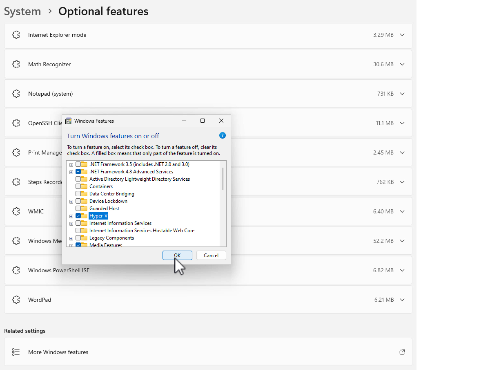
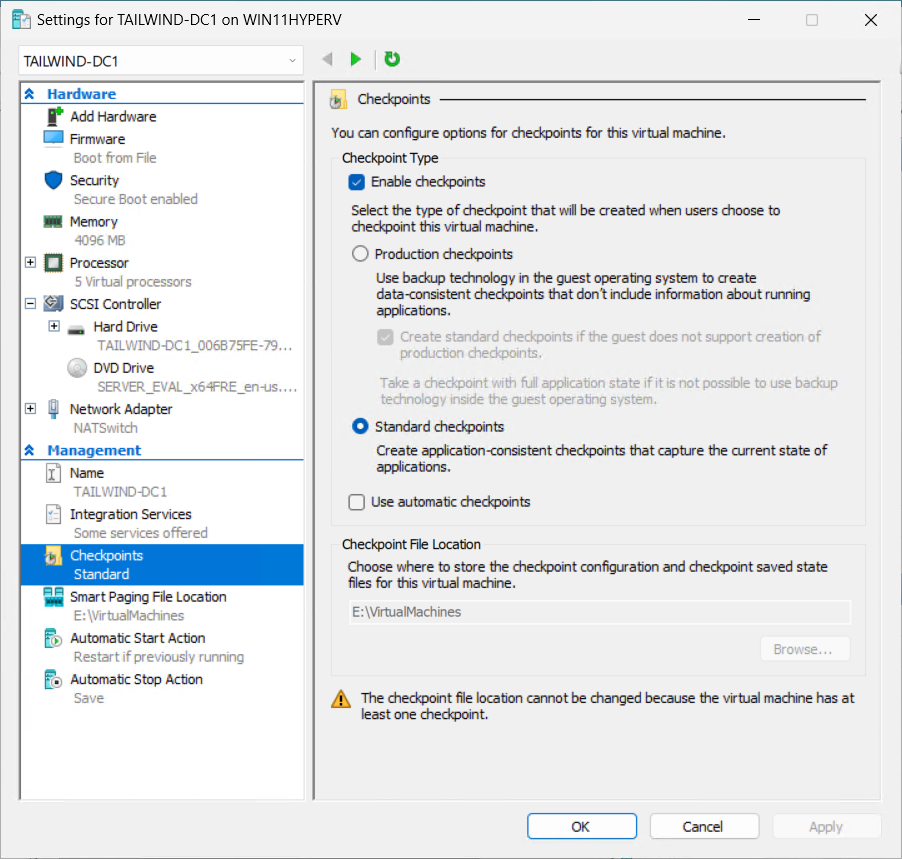

---
lab:
  title: Preparar-se
  module: Guided Project – Administer Active Directory Domain Services
---
## Visão geral do projeto

Neste projeto guiado, você percorre as principais etapas de criação, configuração e manutenção de um controlador de domínio. Você também tem a oportunidade de promover um controlador de domínio.

## Instalação

Para reduzir os requisitos de acesso a recursos (como acesso ao Windows Server ou a uma assinatura do Microsoft Azure), este projeto guiado usa um computador Windows 10 ou Windows 11 para executar um ambiente virtualizado. Configure um subsistema Hyper-V do computador Windows 10 ou Windows 11 para dar suporte às duas máquinas virtuais do Windows Server 2022 Evaluation Edition que você usa neste projeto. Você precisa da edição Professional ou Enterprise do Windows 10 ou Windows 11 para executar essas tarefas.

O computador que funciona como o host de virtualização do Hyper-V deve ter pelo menos 16 GB de RAM. Você também pode usar uma versão de avaliação do Windows Server com a função Hyper-V instalada como host para essas máquinas virtuais ou configurar uma plataforma de virtualização de terceiros para hospedar ambas as máquinas virtuais. Os exercícios e tarefas neste laboratório usam o Windows 11 ao descrever o host Hyper-V. As opções apresentadas aqui facilitam a localização de arquivos de máquinas virtuais grandes se você quiser remover a configuração depois de concluir o projeto.

A seção Instalação consiste em três tarefas principais:

 -  Instalar o Hyper-V
 -  Criar máquina virtual do Controlador de Domínio do Windows Server
 -  Criar servidor membro de domínio do Windows Server

## Instalar o Hyper-V

Nesta tarefa, você instalará o Hyper-V e configurará uma opção NAT. Você configurará o Hyper-V para usar um conjunto diferente de diretórios padrão para armazenar arquivos de máquina virtual e discos rígidos. Você pode usar as opções apresentadas nestas instruções ou escolher seu próprio local.

1.  Entre no computador com Windows 11 com uma conta que tenha privilégios de administrador local.
2.  No computador com Windows 11, clique em **Iniciar**, selecione **Configurações** e, na página Configurações, selecione **Sistema**.
3.  Na página Sistema de Configurações, role para baixo até localizar Recursos opcionais. Selecione **Recursos opcionais**.
4.  Na página Recursos opcionais, role para baixo até localizar **Mais recursos do Windows** em Configurações relacionadas.
5.  Na página Recursos do Windows, marque a caixa de seleção ao lado de Hyper-V e clique em **OK**, conforme mostrado na exposição.
    
    
    
6.  Quando a instalação for concluída, na página Recursos do Windows, clique em **Reiniciar agora**.
7.  Após a reinicialização do computador, entre usando a mesma conta com privilégios de Administrador local.
8.  Clique em **Iniciar** e procure por Gerenciador do Hyper-V. Fixe o Gerenciador do Hyper-V na barra de tarefas.
9.  No Gerenciador do Hyper-V, clique com o botão direito do mouse no computador local e selecione **Configurações do Hyper-V**.
10. Na caixa de diálogo **Configurações do Hyper-V**, em Servidor, selecione **Máquinas Virtuais**. Defina o local da pasta Máquinas Virtuais como C:\\VirtualMachines.
11. Na caixa de diálogo **Configurações do Hyper-V**, em Servidor, selecione **Discos Rígidos da Máquina Virtual**. Defina o local do disco rígido virtual da máquina virtual como C:\\VirtualMachines\\VHDs.
12. Clique em **OK** para fechar a caixa de diálogo **Configurações do Hyper-V**.
13. Abra uma janela do prompt de comando como administrador e execute um dos comandos a seguir para criar uma rede NAT. `New-VMSwitch -SwitchName “NATSwitch” -SwitchType Internal` `New-NetIPAddress -IPAddress 10.10.10.1 -PrefixLength 24 -InterfaceAlias “vEthernet (NATSwitch)”` `New-NetNat -Name “NATNetwork” –InternalIPInterfaceAddressPrefix “10.10.10.0/24”`
14. Feche o prompt de comando administrativo.

## Criar máquina virtual do Controlador de Domínio do Windows Server

Nesta tarefa, você implantará e configurará um Controlador de domínio do Windows Server 2022 para o laboratório no qual executa tarefas relacionadas à credencial de habilidade aplicada. Para executar essa tarefa, certifique-se de ter baixado o arquivo ISO do Windows Server 2022 Evaluation Edition de [https://www.microsoft.com/en-us/evalcenter/download-windows-server-2022](https://www.microsoft.com/en-us/evalcenter/download-windows-server-2022). Coloque o arquivo na pasta C:\\ISOs. Esse ISO de avaliação permite que você execute uma versão completa do Windows Server 2022 por até 180 dias.

1.  No Gerenciador do Hyper-V, selecione o menu **Ações**, e em seguida, **Novo**, **Máquina Virtual**.
2.  Na página Antes de Começar do Assistente de Nova Máquina Virtual, clique em **Avançar**.
3.  Na página Especificar Nome e Local do Assistente Nova Máquina Virtual, digite o nome **TAILWIND-DC1** e clique em **Avançar**.
4.  Na página Especificar Geração, selecione **Geração 2** e clique em **Avançar**.
5.  Na página Atribuir Memória, defina a memória de inicialização como 4096 MB e deixe a opção **Usar Memória Dinâmica para esta máquina virtual** selecionada. Clique em **Avançar**.
6.  Na página Configurar rede, defina a conexão no menu suspenso como NATSwitch e clique em **Avançar**.
7.  Na página Conectar disco rígido virtual, deixe as opções padrão selecionadas e clique em **Avançar**.
8.  Na página Opções de Instalação, selecione a opção **Instalar um sistema operacional a partir de um arquivo de imagem inicializável** e clique em **Procurar** para selecionar o arquivo iso do Windows Server 2022 Evaluation Edition (chamado SERVER\_EVAL\_x64FRE\_en-us.iso). Você já baixou esse arquivo para a pasta C:\\ISOs. Clique em **Avançar**.
9.  Na página Resumo, clique em **Concluir**.
10. No Gerenciador do Hyper-V, clique com o botão direito em TAILWIND-DC1 e selecione **Configurações**.
11. Na página Configurações do TAILWIND-DC1, em Gerenciamento, selecione **Pontos de verificação** e verifique se a opção **Usar pontos de verificação automáticos** não está selecionada, conforme mostrado na captura de tela. Clique em **OK.**
    
    
12. Clique duas vezes em TAILWIND-DC1. Isso abre a janela Conexão da Máquina Virtual. Selecione **Iniciar**. Quando a mensagem “Pressione qualquer tecla para inicializar a partir do CD ou DVD” for exibida, use o mouse para selecionar dentro da janela da máquina virtual e pressione a barra de espaço. Isso define a máquina virtual para inicializar a partir do arquivo ISO anexado.
13. Na página Configuração do sistema operacional do servidor da Microsoft, aceite os padrões e clique em **Avançar**.
14. Na página Pronto para instalar, selecione **Instalar agora**.
15. Na página Configuração do sistema operacional do servidor da Microsoft, selecione **Avaliação Padrão do Windows Server 2022 (Experiência Desktop)** conforme mostrado na captura de tela e clique em **Avançar**.
    
    
    
17. Na página Avisos aplicáveis e termos de licença, revise a licença e marque a caixa de seleção **Aceito**. Clique em **Avançar**.
18. Na caixa Que tipo de instalação você deseja?, selecione **Personalizado**.
19. Na caixa de diálogo Onde você deseja instalar o sistema operacional?, selecione Unidade 0 e clique em **Avançar**. O sistema operacional será instalado. Isso leva vários minutos, dependendo da velocidade do computador que você está usando. A máquina virtual será reiniciada.
20. Na página Personalizar configurações, você será solicitado a fornecer uma senha para a conta de administrador interno. Insira a senha: **Pa55w.rdPa55w.rd** duas vezes. A senha é uma senha de demonstração e não deve ser usada em sistemas de produção. Você também pode escolher sua própria senha aqui. Depois de inserir a senha do administrador duas vezes, clique em **Concluir**. Você não será conectado à máquina virtual em execução.
21. Na tela de bloqueio da máquina virtual, digite a senha do administrador **Pa55w.rdPa55w.rd** para entrar.
22. Depois de entrar, clique com o botão direito do mouse no ícone de rede, representado por um globo na barra de tarefas, e selecione **Abrir configurações de rede e Internet**.
23. Na página Status da Rede, selecione **Alterar opções do adaptador**.
24. Na página Conexões de rede, clique com o botão direito do mouse em **Ethernet** e selecione **Propriedades**.
25. Na página Propriedades de Ethernet, selecione o item Protocolo IP versão 4 (TCP/IPv4) e clique em **Propriedades**.
26. Na guia Geral da página Propriedades do protocolo versão 4 TCP/IPv4, defina a configuração do endereço IP da seguinte maneira e clique em **OK**:
    
    
    1.  Usar o endereço IP a seguir:
        
        
        1.  Endereço IP: 10.10.10.10
        2.  Máscara de sub-rede: 255.255.255.0
        3.  Gateway padrão: 10.10.10.1
    2.  Usar os seguintes endereços de servidor DNS:
        
        
        1.  Servidor DNS preferencial: 1.1.1.1
        2.  Servidor do DNS alternativo: 8.8.8.8
27. Clique em **Fechar**. Quando questionado sobre se deseja permitir que o computador seja detectável, selecione **Sim**.
28. No menu Iniciar, abra o Gerenciador de servidores, selecione Servidor Local e, em seguida, selecione o Nome do computador. Isso abre a caixa de diálogo Propriedades do sistema. Na p[agina Nome do computador da caixa de diálogo Propriedades do sistema, selecione **Alterar**.
29. Na caixa de diálogo Nome do computador/Alterações de domínio, em Nome do computador, digite **TAILWIND-DC1** e clique em **OK**. 
30. Na caixa de diálogo informando que você precisa reiniciar o computador, clique em **OK**.
31. Na caixa de diálogo Propriedades do sistema, clique em **Fechar**.
32. Na caixa de diálogo **Você deve reiniciar o computador para aplicar essas alterações**, clique em **Reiniciar agora**. O computador será reiniciado.
33. Quando o computador for reiniciado, entre como Administrador com a senha configurada durante a instalação.
34. No Gerenciador de Servidores, selecione o menu Gerenciar e então, selecione **Adicionar funções e recursos**.
35. Na página Antes de Você Começar do Assistente de adição de funções e recursos, selecione **Avançar**.
36. Na página Selecionar tipo de instalação, selecione **Instalação baseada em função ou em recurso** e clique em **Avançar**.
37. Na página Selecionar servidor de destino, clique em **Selecionar um servidor no pool de servidores**, certifique-se de que **TAILWIND-CD1** está selecionado e clique em **Avançar**.
38. Na página Selecionar funções de servidor, selecione a caixa de seleção **Active Directory Domain Services**. Isso abre a página "Adicionar recursos". Selecione **Adicionar Recursos**. Na página Selecionar funções do servidor, clique em **Avançar**.
39. Na página Selecionar recursos, clique em **Avançar**.
40. Na página Active Directory Domain Services, clique em **Avançar**.
41. Na página Confirmar seleções da instalação, selecione **Instalar**. Dependendo da velocidade do computador, a instalação pode levar vários minutos. Quando a instalação for concluída, clique em **Fechar**.
42. No menu Gerenciador do servidor, selecione o ícone de notificação ao lado da bandeira no canto superior direito mostrado na captura de tela.

    
43. No menu que é aberto quando você seleciona o ícone de notificação, selecione **Promover este servidor a um controlador de domínio**. O Assistente de Configuração do Active Directory Domain Services.
44. Na página Configuração de implantação, selecione **Adicionar uma nova floresta** e defina o nome de domínio raiz como **tailwindtraders.internal**. Clique em **Avançar**.
45. Ná página de opções do controlador de domínio, use os valores padrão e defina uma senha do DSRM (Modo de restauração de Serviços de Diretório). Para fazer isso, digite a seguinte senha duas vezes: Pa55w.rdPa55w.rd. Clique em **Avançar**.
46. Na página Opções de DNS, clique em **Avançar**.
47. Na página Opções adicionais, clique em **Avançar**.
48. Na página Caminhos, clique em **Avançar**.
49. Na página Revisar opções, clique em **Avançar**.
50. Na página Verificação de pré-requisitos, clique em **Avançar**. A instalação leva vários minutos, dependendo da velocidade da máquina virtual. A máquina virtual será reiniciada.
51. Quando a máquina virtual for reiniciada, entre como **administrador\\tailwindtraders** com a senha que você configurou para a conta de administrador padrão (Pa55w.rdPa55w.rd)

## Criar servidor membro de domínio do Windows Server

Nesta tarefa, você implantará e configurará um servidor membro do Domínio do Windows Server 2022 para o laboratório no qual executa tarefas relacionadas à credencial de habilidade aplicada. Essa tarefa também usa o arquivo iso da edição de avaliação.

1.  No Gerenciador do Hyper-V no menu Ações, selecione **Novo** e então, selecione **Máquina Virtual**.
2.  Na página Antes de Começar do Assistente de Nova Máquina Virtual, clique em **Avançar**.
3.  Na página Especificar Nome e Local do Assistente para Nova Máquina Virtual, insira o nome **TAILWIND-MBR1** e clique em **Avançar**.
4.  Na página Especificar Geração, selecione **Geração 2** e clique em **Avançar**.
5.  Na página Atribuir Memória, defina a memória de inicialização como 4096 MB e deixe a opção **Usar Memória Dinâmica para esta máquina virtual** selecionada. Clique em **Avançar**.
6.  Na página Configurar rede, defina a conexão no menu suspenso como **NATSwitch** e clique em **Avançar**.
7.  Na página Conectar disco rígido virtual, deixe as opções padrão selecionadas e clique em **Avançar**.
8.  Na página Opções de instalação, selecione a opção **Instalar um sistema operacional a partir de um arquivo de imagem inicializável** e clique em **Procurar** para selecionar o arquivo iso do Windows Server 2022 Evaluation Edition (chamado SERVER\_EVAL\_x64FRE\_en-us.iso) que você baixou para a pasta C:\\ISOs. Clique em **Avançar**.
9.  Na página Resumo, clique em **Concluir**.
10. No Gerenciador do Hyper-V, clique com o botão direito em **TAILWIND-MBR1** e selecione **Configurações**.
11. Na página Configurações do TAILWIND-MBR1, em Gerenciamento, selecione **Pontos de verificação**, verifique se a opção **Usar pontos de verificação automáticos** não está selecionada e clique em **OK**.
12. Clique duas vezes em TAILWIND-MBR1. Isso abre a janela de conexão da máquina virtual. Clique em **Iniciar**. Quando a mensagem “Pressione qualquer tecla para inicializar a partir de CD ou DVD” for exibida, use o mouse para selecionar dentro da janela da máquina virtual e pressione a barra de espaço. Isso define a máquina virtual para inicializar a partir do arquivo ISO anexado.
13. Na página Configuração do sistema operacional do servidor da Microsoft, aceite os padrões e clique em **Avançar**.
14. Na página Instalar agora , clique em **Instalar agora**.
15. Na página Configuração do Sistema Operacional do Servidor da Microsoft, selecione **Avaliação Padrão do Windows Server 2022 (Experiência Desktop)** e clique em **Avançar**.
16. Na página Avisos aplicáveis e termos de licença, revise a licença e marque a caixa de seleção **Aceito**. Clique em **Avançar**.
17. Na caixa Que tipo de instalação você deseja?, selecione **Personalizado**.
18. Na caixa de diálogo Onde você deseja instalar o sistema operacional?, selecione **Unidade 0** e clique em **Avançar**. O sistema operacional será instalado. Isso leva vários minutos, dependendo da velocidade do computador que você está usando. A máquina virtual será reiniciada.
19. Na página Personalizar configurações, você será solicitado a fornecer uma senha para a conta de administrador interno. Insira a senha: **Pa55w.rdPa55w.rd** duas vezes. A senha é uma senha de demonstração e não deve ser usada em sistemas de produção. Você também pode escolher sua própria senha aqui. Depois de inserir a senha do administrador duas vezes, selecione **Concluir**. Você não será conectado à máquina virtual em execução.
20. Na tela de bloqueio da máquina virtual, digite a senha do administrador **Pa55w.rdPa55w.rd** para entrar.
21. Depois de entrar, clique com o botão direito do mouse no ícone de rede, representado por um globo na barra de tarefas, e selecione **Abrir configurações de rede e Internet**.
22. Na página Status da Rede, selecione **Alterar opções do adaptador**.
23. Na página Conexões de rede, clique com o botão direito do mouse em **Ethernet** e selecione **Propriedades**.
24. Na página Propriedades de Ethernet, selecione o item **Protocolo IP versão 4 (TCP/IPv4)** e clique em **Propriedades**.
25. Na guia Geral da página Propriedades do protocolo versão 4 TCP/IPv4, defina a configuração do endereço IP da seguinte maneira e clique em **OK**:
    
    
    1.  Usar o endereço IP a seguir:
        
        
        1.  Endereço IP: 10.10.10.20
        2.  Máscara de sub-rede: 255.255.255.0
        3.  Gateway padrão: 10.10.10.1
    2.  Usar os seguintes endereços de servidor DNS:
        
        
        1.  Servidor DNS preferencial: 10.10.10.10
        2.  Servidor do DNS alternativo: 8.8.8.8
26. Clique em **Fechar**. Quando questionado sobre se deseja permitir que o computador seja detectável, selecione **Sim**.
27. No menu Iniciar, abra o Gerenciador de Servidores, selecione **Servidor Local** e, em seguida, selecione o Nome do Computador. Isso abre a caixa de diálogo Propriedades do sistema. Na p[agina Nome do computador da caixa de diálogo Propriedades do sistema, selecione **Alterar**.
28. Na caixa de diálogo Nome do Computador/Alterações de Domínio, defina o nome do computador como **TAILWIND-MBR1** e então, clique em **OK**. 
29. Na caixa de diálogo informando que você precisa reiniciar o computador, clique em **OK**.
30. Na caixa de diálogo **Propriedades do Sistema**, clique em Fechar.
31. Na caixa de diálogo Você deve reiniciar o computador para aplicar essas alterações, clique em **Reiniciar agora**. O computador será reiniciado.
32. Quando o computador for reiniciado, entre como Administrador com a senha configurada durante a instalação.
33. Na janela Gerenciador de Servidores à esquerda, selecione a seção Servidor Local. Na seção Servidor Local, selecione TAILWIND-MBR1 ao lado de Nome do Computador. Isso abre a caixa de diálogo Propriedades do sistema.
34. Na caixa de diálogo Propriedades do sistema, clique em **Alterar**.
35. Na caixa de diálogo Alterações de Nome/Domínio do Computador, selecione **Domínio em Membro de**, insira o nome de domínio **TAILWINDTRADERS** e clique em **OK.**
36. Na caixa de diálogo Alterações de Nome/Domínio do Computador, digite o seguinte nome de usuário e senha e clique em **OK**:
    
    
    1.  Nome de usuário: TAILWINDTRADERS\\Administrador
    2.  Senha: Pa55w.rdPa55w.rd
37. Momentaneamente, a caixa de diálogo Bem-vindo ao domínio Tailwintraders aparecerá. Clique em **OK.**
38. Na caixa de diálogo **Propriedades do Sistema**, clique em Fechar.
39. Na caixa de diálogo solicitando que você reinicie o computador, clique em **Reiniciar agora**.
